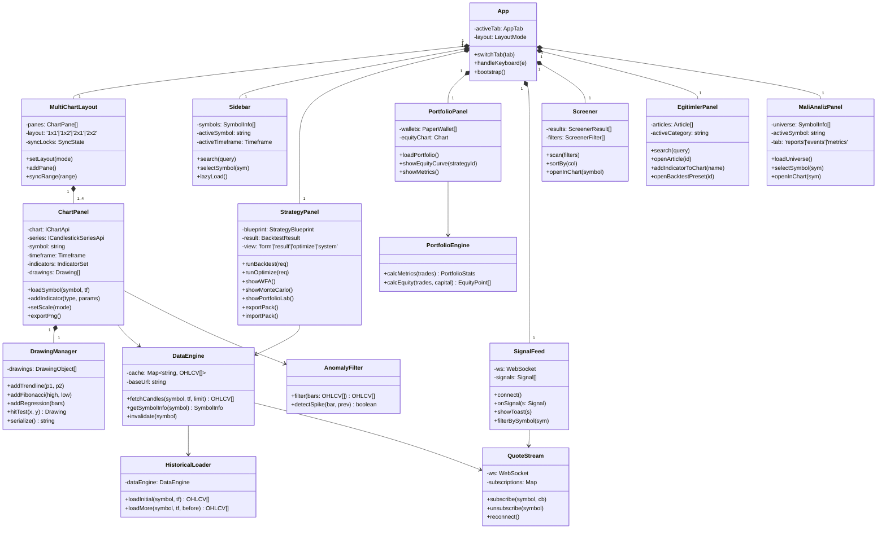
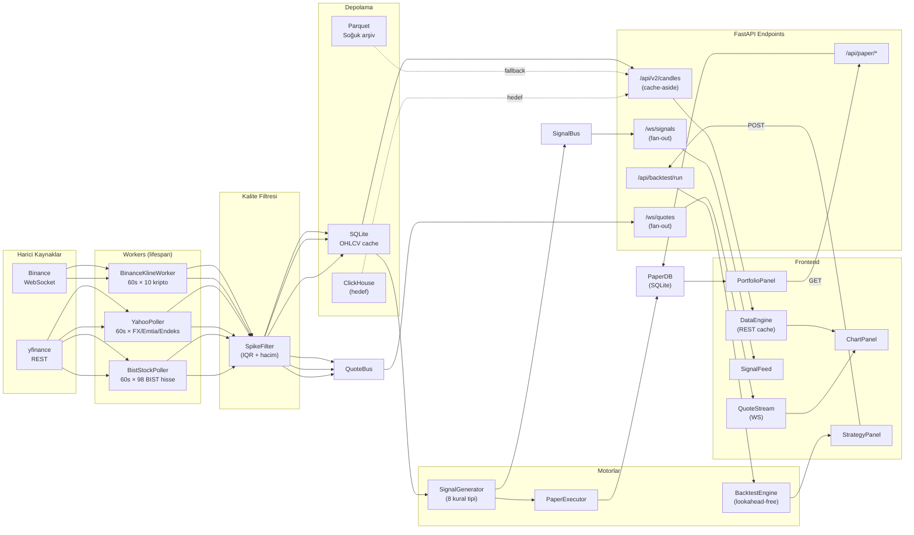
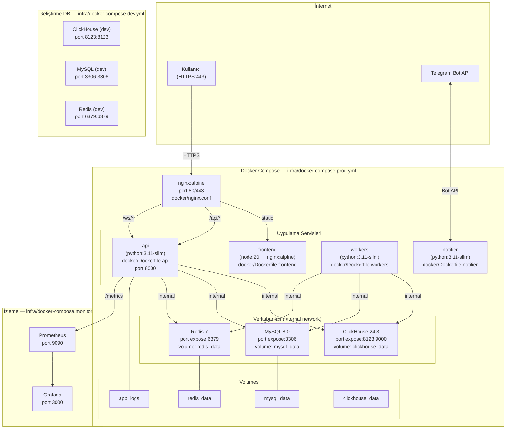
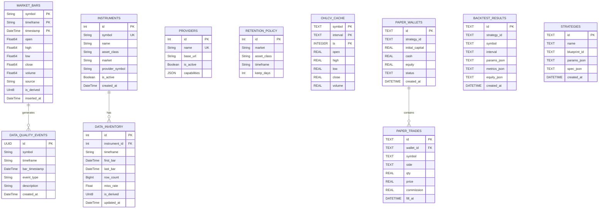
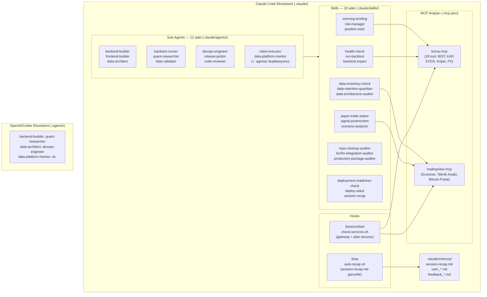

# PiyasaPilot — UML Diyagramları

> Tarih: 2026-05-05 · Tüm diyagramlar Mermaid formatındadır.

---

## 1. Sistem Mimarisi (C4 — Component)

```mermaid
graph TB
    subgraph KULLANICI["Kullanıcı"]
        BROWSER["🌐 Tarayıcı"]
        TELEGRAM["📱 Telegram"]
    end

    subgraph FRONTEND["Frontend — TypeScript / Vite (port 5173)"]
        APP["app.ts\n(Tab Yönetici)"]
        CHART["ChartPanel\n(OHLCV Grafik)"]
        STRATEGY["StrategyPanel\n(Backtest Lab)"]
        PORTFOLIO["PortfolioPanel\n(Paper Trading)"]
        SCREENER["Screener\n(Tarayıcı)"]
        SIGNALFEED["SignalFeed\n(Sinyaller)"]
        EDUCATION["EgitimlerPanel\n(57 makale)"]
        FINANCIAL["MaliAnalizPanel\n(Finansal)"]
        MULTICHART["MultiChartLayout\n(Grid 1×1 / 2×2)"]
        DATAENGINE["DataEngine\n(REST Cache)"]
        QUOTESTREAM["QuoteStream\n(WS /ws/quotes)"]
    end

    subgraph NGINX["nginx (port 80/443)"]
        PROXY["Reverse Proxy\nTLS Termination"]
    end

    subgraph BACKEND["Backend — FastAPI / uvicorn (port 8000)"]
        MAIN["main.py\n(App Factory)"]
        APIKEY["APIKeyMiddleware\nX-API-Key"]
        CORS["CORSMiddleware"]

        subgraph BUS["Event Bus'lar"]
            QUOTEBUS["QuoteBus\n(/ws/quotes fan-out)"]
            SIGNALBUS["SignalBus\n(/ws/signals fan-out)"]
        end

        subgraph WORKERS["Veri İşçileri"]
            SUPERVISOR["WorkerSupervisor"]
            BINANCE["BinanceKlineWorker\n(WS — 10 kripto)"]
            YAHOO["YahooPoller\n(REST — 60s)"]
            BIST["BistStockPoller\n(REST — 60s)"]
        end

        subgraph SIGNALS["Sinyal Motoru"]
            SIGGEN["SignalGenerator\n(8 kural tipi)"]
            DECISION["DecisionEngine\n(Konsensüs)"]
        end

        subgraph DATA["Veri Katmanı"]
            CACHE["OHLCVCache\n(SQLite)"]
            HISTSTORE["HistoricalStore\n(Parquet)"]
            SPIKEFILTER["SpikeFilter\n(IQR + VWAP)"]
            CHREPO["ClickHouseRepository\n(⚠ bağlanmadı)"]
            MYSQLREPO["MySQLMetadataRepository\n(⚠ bağlanmadı)"]
            REDISCACHE["RedisMarketCache\n(⚠ bağlanmadı)"]
        end

        subgraph BACKTEST["Backtest Modülü"]
            RUNNER["BacktestRunner"]
            ARCHIVE["BacktestArchive\n(SQLite)"]
        end

        subgraph PAPER["Paper Trading"]
            EXECUTOR["PaperExecutor"]
            PAPERDB["PaperDB\n(SQLite)"]
        end

        subgraph NOTIFIER["Bildirim"]
            TELEGRAM_SVC["TelegramListener\n(11 komut)"]
            EMAIL["EmailNotifier\n(SMTP)"]
        end

        subgraph MALI["Mali Analiz"]
            MALISVC["FinancialAnalysisService\n(metadata-only)"]
            MALICACHE["FinancialAnalysisCache\n(SQLite)"]
        end
    end

    subgraph QUANTENGINE["quant_engine — Backtest Framework (Python)"]
        ENGINE["BacktestEngine\n(Lookahead-free)"]
        PORTFOLIO_QE["Portfolio\n(Position / Fill / Order)"]
        STRATEGIES["Strategy Implementations\n(9 strateji)"]
        PROVIDER_ROUTER["ProviderRouter"]
        LIVE_FEED["LiveDataService"]
        WFA["WalkForwardAnalysis"]
        MONTECARLO["MonteCarloReport"]
        OPTIMIZER["GridSearchOptimizer"]
        STRATSTORE["StrategyStore\n(SQLite)"]
    end

    subgraph DB["Veritabanları"]
        SQLITE["SQLite\n(aktif — cache)"]
        CLICKHOUSE["ClickHouse\n(hedef — OHLCV)"]
        MYSQL["MySQL\n(hedef — metadata)"]
        REDIS["Redis\n(hedef — cache/pubsub)"]
        PARQUET["Parquet\n(soğuk arşiv)"]
    end

    subgraph PROVIDERS["Harici Veri Sağlayıcıları"]
        BINANCE_EXT["Binance\nWebSocket + REST"]
        YFINANCE["yfinance\nBIST / FX / Emtia"]
        BORSAPY["borsapy\n(BIST)"]
    end

    BROWSER -- "HTTPS (REST+WS)" --> NGINX
    TELEGRAM -- "Bot API" --> TELEGRAM_SVC
    NGINX --> FRONTEND
    NGINX -- "/api/*" --> MAIN
    NGINX -- "/ws/*" --> MAIN

    APP --> CHART & STRATEGY & PORTFOLIO & SCREENER & SIGNALFEED & EDUCATION & FINANCIAL & MULTICHART
    CHART --> DATAENGINE
    STRATEGY --> DATAENGINE
    DATAENGINE --> QUOTESTREAM
    MULTICHART --> CHART

    MAIN --> APIKEY --> CORS
    MAIN --> BUS & WORKERS & SIGNALS & DATA & BACKTEST & PAPER & MALI
    SUPERVISOR --> BINANCE & YAHOO & BIST
    BINANCE --> QUOTEBUS
    YAHOO --> QUOTEBUS
    BIST --> QUOTEBUS
    SIGGEN --> DECISION --> SIGNALBUS

    RUNNER --> ENGINE
    ENGINE --> PORTFOLIO_QE
    ENGINE --> STRATEGIES
    WFA & OPTIMIZER & MONTECARLO --> ENGINE

    CACHE --> SQLITE
    HISTSTORE --> PARQUET
    ARCHIVE --> SQLITE
    PAPERDB --> SQLITE
    MALICACHE --> SQLITE
    CHREPO -.-> CLICKHOUSE
    MYSQLREPO -.-> MYSQL
    REDISCACHE -.-> REDIS

    BINANCE --> BINANCE_EXT
    YAHOO & BIST --> YFINANCE
    LIVE_FEED --> PROVIDER_ROUTER --> YFINANCE & BORSAPY & BINANCE_EXT
```

---

## 2. Backend Sınıf Diyagramı

```mermaid
classDiagram
    class FastAPI_App {
        +lifespan()
        +create_app() FastAPI
        +APIKeyMiddleware
        +CORSMiddleware
    }

    class QuoteBus {
        -_subs: list~_Subscription~
        +subscribe(symbol) AsyncGenerator
        +publish(symbol, data)
    }

    class SignalBus {
        -_subs: list~_Subscription~
        +subscribe() AsyncGenerator
        +publish(signal)
    }

    class WorkerSupervisor {
        -_workers: list~AsyncWorker~
        +start()
        +stop()
        +health() dict
    }

    class AsyncWorker {
        <<abstract>>
        +name: str
        +run()
        +stop()
    }

    class BinanceKlineWorker {
        -symbols: list~str~
        +run()
    }

    class YahooPoller {
        -symbols: list~str~
        -interval_s: int
        +run()
    }

    class BistStockPoller {
        +run()
    }

    class SignalGenerator {
        -config: SignalGeneratorConfig
        +generate(symbol, bars) list~Signal~
        +evaluate_rules() list
    }

    class SignalGeneratorConfig {
        +consensus_threshold: int
        +min_strength: int
        +signal_types: list~str~
    }

    class OHLCVCache {
        -db_path: Path
        +read(symbol, interval, start, end) list~Bar~
        +write(symbol, interval, bars)
        +stats() CacheStats
    }

    class HistoricalStore {
        -data_dir: Path
        +read(symbol, interval) DataFrame
    }

    class SpikeFilter {
        +filter_bars(bars, symbol) tuple
    }

    class MarketRepository {
        <<abstract>>
        +get_bars(symbol, interval, start, end)*
        +save_bars(symbol, interval, bars)*
    }

    class ClickHouseMarketRepository {
        -url: str
        +get_bars()
        +save_bars()
    }

    class LegacyFileMarketRepository {
        +get_bars()
        +save_bars()
    }

    class MySQLMetadataRepository {
        -url: str
        +connect()
        +list_instruments() list
        +get_inventory() dict
    }

    class RedisMarketCache {
        -url: str
        +get_quote(symbol) dict
        +set_quote(symbol, data, ttl)
    }

    class BacktestArchive {
        -db_path: Path
        +save(result) str
        +load(id) BacktestResult
        +list() list
    }

    class PaperExecutor {
        -db: PaperDB
        +execute(signal)
        +get_portfolio(strategy_id) dict
    }

    class PaperDB {
        -db_path: Path
        +create_wallet(strategy_id)
        +record_trade(wallet_id, trade)
        +get_equity(wallet_id) list
    }

    class APIKeyMiddleware {
        +EXEMPT_PATHS: frozenset
        +dispatch(request, call_next) Response
    }

    class FinancialAnalysisService {
        -provider: FinancialAnalysisProvider
        -cache: FinancialAnalysisCache
        +get_reports(symbol) FinancialAnalysisResponse
        +get_events(symbol) list
        +get_metric_history(symbol) list
    }

    class FinancialAnalysisProvider {
        <<Protocol>>
        +fetch_reports(symbol)*
        +fetch_events(symbol)*
    }

    class MockFinancialAnalysisProvider {
        +fetch_reports(symbol)
        +fetch_events(symbol)
    }

    WorkerSupervisor "1" *-- "many" AsyncWorker
    AsyncWorker <|-- BinanceKlineWorker
    AsyncWorker <|-- YahooPoller
    YahooPoller <|-- BistStockPoller

    MarketRepository <|-- ClickHouseMarketRepository
    MarketRepository <|-- LegacyFileMarketRepository

    FinancialAnalysisProvider <|.. MockFinancialAnalysisProvider
    FinancialAnalysisService --> FinancialAnalysisProvider

    PaperExecutor --> PaperDB
    SignalGenerator --> SignalGeneratorConfig

    FastAPI_App --> QuoteBus
    FastAPI_App --> SignalBus
    FastAPI_App --> WorkerSupervisor
    FastAPI_App --> SignalGenerator
    FastAPI_App --> OHLCVCache
    FastAPI_App --> HistoricalStore
    FastAPI_App --> BacktestArchive
    FastAPI_App --> PaperExecutor
    FastAPI_App --> FinancialAnalysisService
    FastAPI_App --> APIKeyMiddleware
```

---

## 3. quant_engine Sınıf Diyagramı

```mermaid
classDiagram
    class BacktestEngine {
        -config: BacktestConfig
        +run(symbol, bars, strategy) BacktestResult
        +_simulate()
    }

    class BacktestConfig {
        +initial_capital: float
        +commission_rate: float
        +slippage_bps: int
        +max_position_pct: float
    }

    class BacktestResult {
        +metrics: PerformanceMetrics
        +equity_curve: list~EquityPoint~
        +trades: list~CompletedTrade~
        +quality_warnings: list~QualityWarning~
        +wfa_report: WalkForwardReport
        +monte_carlo: MonteCarloReport
        +portfolio_lab: PortfolioLabSummary
        +lifecycle: LifecycleSummary
    }

    class Portfolio {
        +cash: float
        +positions: dict~str, Position~
        +equity_history: list~EquityPoint~
        +place_order(order) Fill
        +get_equity() float
    }

    class Position {
        +symbol: str
        +qty: float
        +avg_entry_price: float
        +unrealized_pnl() float
    }

    class Order {
        +symbol: str
        +side: OrderSide
        +qty: float
        +order_type: OrderType
        +signal_timestamp: datetime
    }

    class Fill {
        +order: Order
        +fill_price: float
        +fill_timestamp: datetime
        +commission: float
    }

    class CompletedTrade {
        +entry_fill: Fill
        +exit_fill: Fill
        +pnl: float
        +pnl_pct: float
    }

    class PerformanceMetrics {
        +total_return_pct: float
        +cagr: float
        +sharpe_ratio: float
        +sortino_ratio: float
        +max_drawdown_pct: float
        +win_rate: float
        +profit_factor: float
        +total_trades: int
    }

    class BaseStrategy {
        <<abstract>>
        +name: str
        +params: StrategyParams
        +generate_signals(data, bar_index, portfolio)*
        +as_signal_func() Callable
    }

    class SmaCrossover { +fast_period +slow_period }
    class RsiReversion { +rsi_period +oversold +overbought }
    class BollingerReversion { +period +std_dev }
    class BuyAndHold { }
    class DonchianBreakout { +period }
    class MacdDivergence { +fast +slow +signal }
    class Supertrend { +period +multiplier }
    class MeanReversionVwap { +threshold }
    class LightgbmProbability { +model_path }

    class StrategyRegistry {
        -_registry: dict~str, type~
        +register(name, cls)
        +get(name) type
        +list() list~str~
    }

    class StrategyStore {
        -db_path: Path
        +save(record) str
        +load(id) StrategyRecord
        +list() list~StrategyRecord~
    }

    class StrategyRecord {
        +id: str
        +name: str
        +blueprint_id: str
        +params: dict
        +spec: StrategySpec
        +paper_activation: PaperActivation
    }

    class StrategyPreset {
        +id: str
        +name: str
        +blueprint_id: str
        +default_params: dict
        +description: str
    }

    class WalkForwardAnalysis {
        -engine: BacktestEngine
        -config: WalkForwardConfig
        +run(symbol, bars, strategy) WalkForwardReport
    }

    class WalkForwardReport {
        +windows: list~WalkForwardWindowResult~
        +avg_oos_sharpe: float
        +stability_score: float
    }

    class GridSearchOptimizer {
        -engine: BacktestEngine
        +run(param_grid) OptimizationResult
    }

    class OptimizationResult {
        +best_params: dict
        +best_sharpe: float
        +heatmap: dict
        +stable_region: dict
    }

    class MonteCarloReport {
        +n_simulations: int
        +p05_return: float
        +p95_return: float
        +p05_max_dd: float
        +median_return: float
    }

    class BaseProvider {
        <<abstract>>
        +fetch_bars(request) FetchResult*
        +capabilities() ProviderCapabilities
    }

    class YFinanceProvider {
        +fetch_bars(request) FetchResult
    }

    class BinanceProvider {
        +fetch_bars(request) FetchResult
        +fetch_ws_kline(symbol)
    }

    class ProviderRouter {
        -providers: list~BaseProvider~
        +route(symbol, interval) BaseProvider
        +fetch(symbol, interval, start, end) DataFrame
    }

    class LiveDataService {
        -router: ProviderRouter
        +fetch_candles(symbol, interval, limit) list~Bar~
        +get_symbol_info(symbol) SymbolSpec
    }

    class DataValidator {
        +validate(df) ValidationResult
        +auto_fix(df) DataFrame
    }

    class ValidationResult {
        +score: int
        +errors: list~str~
        +warnings: list~str~
        +checks_passed: int
    }

    BacktestEngine --> BacktestConfig
    BacktestEngine --> Portfolio
    BacktestEngine --> BaseStrategy
    BacktestEngine --> DataValidator
    Portfolio "1" *-- "many" Position
    Portfolio --> Order
    Order --> Fill
    Fill --> CompletedTrade
    BacktestResult --> PerformanceMetrics
    BacktestResult --> WalkForwardReport
    BacktestResult --> MonteCarloReport

    BaseStrategy <|-- SmaCrossover
    BaseStrategy <|-- RsiReversion
    BaseStrategy <|-- BollingerReversion
    BaseStrategy <|-- BuyAndHold
    BaseStrategy <|-- DonchianBreakout
    BaseStrategy <|-- MacdDivergence
    BaseStrategy <|-- Supertrend
    BaseStrategy <|-- MeanReversionVwap
    BaseStrategy <|-- LightgbmProbability

    StrategyRegistry --> BaseStrategy
    StrategyStore --> StrategyRecord

    WalkForwardAnalysis --> BacktestEngine
    GridSearchOptimizer --> BacktestEngine

    BaseProvider <|-- YFinanceProvider
    BaseProvider <|-- BinanceProvider
    ProviderRouter "1" *-- "many" BaseProvider
    LiveDataService --> ProviderRouter
    DataValidator --> ValidationResult
```

---

## 4. Frontend Bileşen Diyagramı

---

## 5. Veri Akış Diyagramı

---

## 6. Altyapı ve Docker Diyagramı

---

## 7. Veritabanı Şema Diyagramı

---

## 8. AI Ekosistemi Diyagramı

